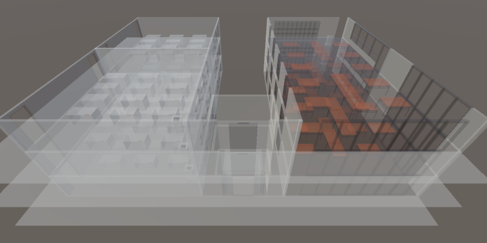

### 1. 프로잭트 소개

로봇 진화형 건물 (미래관)

<iframe src="https://share.synthesia.io/embeds/videos/c3633c3b-e10c-495e-8d16-4cd60f616770" loading="lazy" title="Synthesia video player - Your AI video" allow="encrypted-media; fullscreen;" style="position: absolute; width: 100%; height: 100%; top: 0; left: 0; border: none; padding: 0; margin: 0; overflow:hidden;"></iframe>

### 2. 소개 영상

프로젝트 소개하는 영상을 추가하세요

#### 2.1 Multi Agent Path Planning

| SIPP | SIPP with Interval Axis |
| --- | --- |
|  |  |

로봇

#### 2.2 건물 모습

### 3. 팀 소개

팀을 소개하세요.

- 팀장: 박정현(****1617)
- 팀원: 장병준(****1686)

### 4. 사용법

소스코드제출시 설치법이나 사용법을 작성하세요.

### 5. 기타

[회의록](https://docs.google.com/document/d/1Jag0lyQDvFNUKjmpU1_TOHbEmVOhvqhIF1oz9uKTGSA/edit?usp=sharing)
