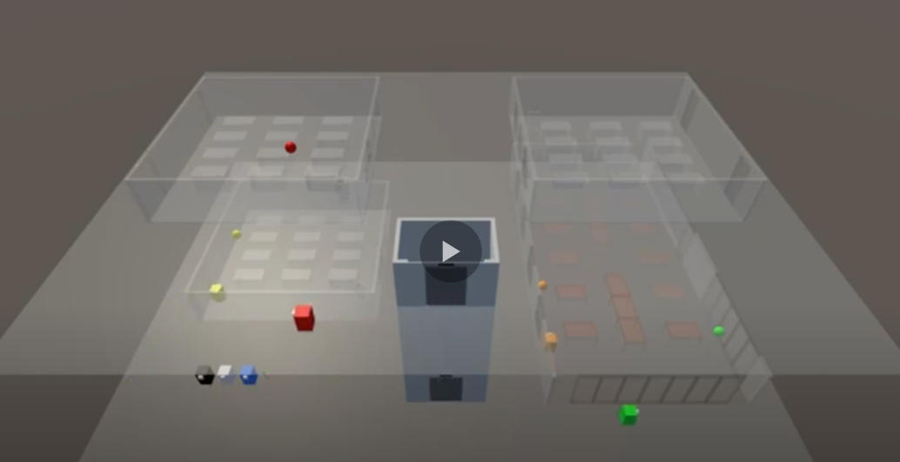
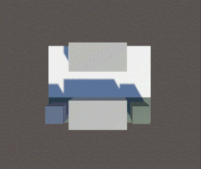
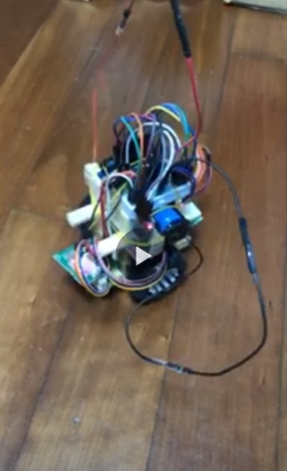
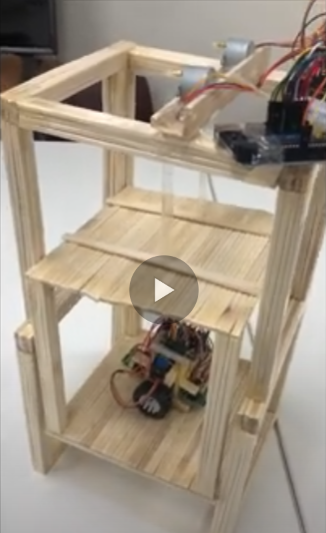
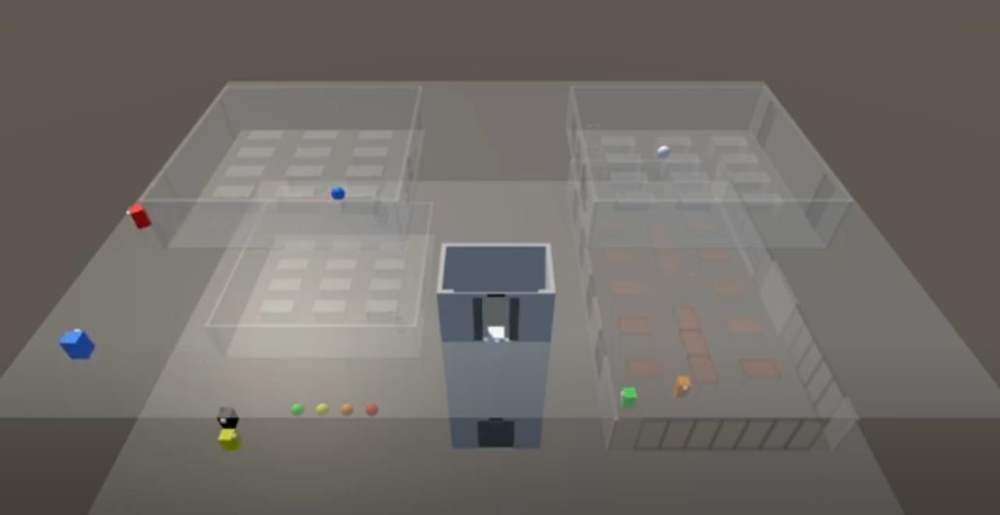

# 로봇 친화형 미래관 ROBOFREE : ROBOt FRiEndly miraE-gwan

## 1. 프로젝트 소개

기술은 서로 연결되고 합쳐질 때 더 큰 의미를 갖습니다.
미래관-사람-기술-로봇이 촘촘히 연결되고 융합되는

로봇 친화형 미래관

일상을 변화시킬 새로움을 만드는 것에 도전했습니다.

로봇과 함께하는 일상
로봇이 우리 삶에 자연스럽게 녹아드는 세상을 준비합니다.
가능성을 보기위한 거대한 실험이
로봇 친화형 미래관에서 시작되었습니다.

## 2. 소개 영상

### Multi Agent Path Planning

| SIPP | SIPP with Interval Axis |
| --- | --- |
|  |  |

### 서비스 로봇

### 로봇 엘리베이터

### 뼈대 건물

## 3. 팀 소개

- 팀장: 박정현(****1617)
- 팀원: 장병준(****1686)

## 4. 사용법

소스코드제출시 설치법이나 사용법을 작성하세요.

## 5. 기타

[회의록](https://docs.google.com/document/d/1Jag0lyQDvFNUKjmpU1_TOHbEmVOhvqhIF1oz9uKTGSA/edit?usp=sharing)